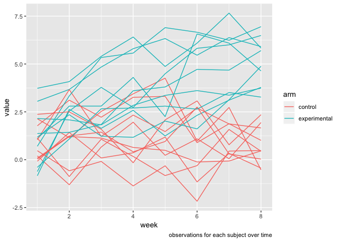
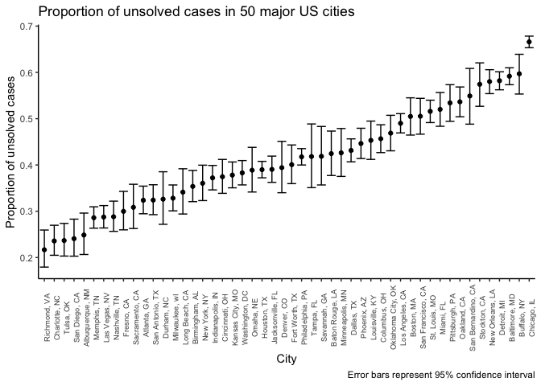

Homework5
================
Chirag Shah
2018-11-07

``` r
library(tidyverse)
library(rvest)
library(purrr)

set.seed(1)
```

Problem 1
---------

``` r
temp = list.files("./data/", full.names = TRUE) 
##obtaining file names and path, creating a list called temp

study_df = temp %>% 
  map(read_csv)
##creating a dataframe using map to read in data within the list

for (i in 1:20)
  if (i <= 10) {
    study_df[[i]] = study_df[[i]] %>% 
      mutate(arm = "control", study_id = i)
  } else if (i > 10) {
    study_df[[i]] = study_df[[i]] %>% 
      mutate(arm = "experimental", study_id = i - 10)
  }
##here I used a for loop to parse through the csv file names in the list to create a variable for arm

study_data = bind_rows(study_df) %>% 
  gather(key = "week", week_1:week_8, value = "value") %>% 
  ##creating a week variable from the multiple week columns 
  mutate(week = as.numeric(str_extract(week, "\\d"))) 
  ##making week a numeric variable
```

``` r
study_data %>% 
  mutate(study_id = as.character(study_id)) %>% 
  group_by(arm, study_id) %>%
  ggplot(aes(x = week, y = value, type = study_id, color = arm)) +
  geom_line() +
  ##Creating spaghetti plot
  labs(y = "value", caption = "observations for each subject over time")
```



This spaghetti plot shows that observation value change over time for each individual in each arm of the study. We can see that the trend is generally going in the upward direction for the experimental group whereas the control group is more stable and closer to horizontal as time progresses. The experimental group generally has higher values compared to the control group.

Problem 2
---------

``` r
homicides = read_csv("https://raw.githubusercontent.com/washingtonpost/data-homicides/master/homicide-data.csv")
```

    ## Parsed with column specification:
    ## cols(
    ##   uid = col_character(),
    ##   reported_date = col_integer(),
    ##   victim_last = col_character(),
    ##   victim_first = col_character(),
    ##   victim_race = col_character(),
    ##   victim_age = col_character(),
    ##   victim_sex = col_character(),
    ##   city = col_character(),
    ##   state = col_character(),
    ##   lat = col_double(),
    ##   lon = col_double(),
    ##   disposition = col_character()
    ## )

``` r
##reading in data from github 
```

The dataset contains 52179 reports on homicides and 12 variables. The homicide information contained in this dataset shows us the data for homicides in 50 US cities for a decade.

``` r
homicides = homicides %>% 
  unite("city_state", c("city", "state"), sep = ", ", remove = TRUE)
##creating city_state variable by uniting the city and state 
```

``` r
total_homicides = homicides %>% 
  group_by(city_state) %>% 
  summarize(total_homicides = n())
```

The total\_homicides dataset gives the total number of homicides in each city. Chicago by far has the highest number of total homicides.

``` r
unsolved_homicides = homicides %>% 
  filter(disposition %in% c("Open/No arrest", "closed without arrest")) %>%
  ##creating a dataset with unsolved homicides by filtering by the disposition that reflects an unsolved homicide
  group_by(city_state) %>% 
  summarize(unsolved_homicides = n())
```

The unsolved\_homicides dataset gives the total number of unsolved homicides (those homicides that were classified as "open/no arrest" or "closed without arrest") in each city. Chicago by far has the highest number of unsolved homicides.

``` r
total_cases = 
  left_join(unsolved_homicides, total_homicides, by = "city_state")
```

The total\_cases dataset combines the two prior datasets so that we can see the number of unsolved homicides and the number of total homicides in each city within the same dataset.

``` r
prop_unsolved = function(df) {
  ##creating a function called prop_unsolved that will use the prop.test function
  ci_unsolved = prop.test(df$unsolved_homicides, df$total_homicides)
  ##utilizing the relevant columns within the total_cases dataset with unsolved homicides being the number of "successes" and total homicides being the total. This will yield the success rate, or in this case the rate at which homicides go unsolved in various cities
  
  ##using broom tidy to keep the estimate and bounds in the dataset
  broom::tidy(ci_unsolved) %>% 
    select(estimate, conf.low, conf.high)
}
```

``` r
total_cases %>% 
  filter(city_state == "Baltimore, MD") %>% 
  prop_unsolved() %>% 
  mutate(estimate = round(estimate, 2), 
         conf.low = round(conf.low, 2), 
         conf.high = round(conf.high, 2)) %>% 
  rename("lower bound" = conf.low, 
         "upper bound" = conf.high) %>% 
  knitr::kable()
```

|  estimate|  lower bound|  upper bound|
|---------:|------------:|------------:|
|      0.59|         0.57|         0.61|

The above table shows the proportion of homicides that go unsolved in baltimore with the upper and lower bounds of the confidence interval.

``` r
city_nest = nest(total_cases, unsolved_homicides:total_homicides)
##
##iterating prop_unsolved over list column 'data' for each city
unsolved_ci = city_nest %>% 
  mutate(prop_unsolved = map(data, prop_unsolved)) %>% 
  ##using the function created above to run prop.test for each city in the dataset thereby obtaining the proportion of unsolved homicides and the confidence interval for each city
  unnest() %>% 
  rename(conf_low = conf.low, 
         conf_high = conf.high)

##making a plot
unsolved_ci %>% 
  mutate(city_state = fct_reorder(city_state, estimate)) %>% 
  ggplot(aes(x = city_state, y = estimate)) + 
  geom_point() + 
  geom_errorbar(aes(ymin = conf_low, ymax = conf_high)) + 
  labs(title = "Proportion of unsolved cases in 50 major US cities", 
       y = "Proportion of unsolved cases", 
       x = "City", 
       caption = "Error bars represent 95% confidence interval") + 
  theme_classic() +
  theme(axis.text.x = element_text(angle = 90, size = 7))
```



The above plot shows the estimates for the proportion of unsolved homicides in each city with the upper and lower bounds of the confidence interval. The cities are organized from lowest unsolved homicide proportion to the highest proportion. Once again Chicago comes out on top.
